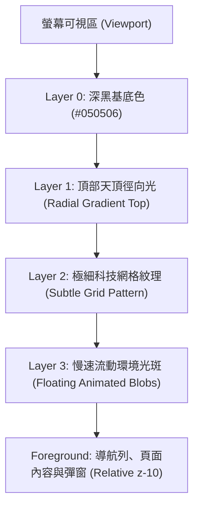

# Styling Infrastructure & Project Configuration Survey Report

**Document Version**: 1.0.0  
**Target Project**: QuizMaster (`c:/Users/yaco9/Documents/antigravity/lively-galileo`)  
**Date**: 2026-09-19  
**Investigator**: `teamwork_preview_explorer_survey_1`

---

## 1. 現有專案設定與樣式架構現況 (Current Project State)

### 1.1 `package.json` 依賴分析
* **核心框架**: Next.js `14.2.15` (App Router 架構) + React `18.3.1`
* **樣式工具**: Tailwind CSS `3.4.14`, PostCSS `8.4.47`, Autoprefixer `10.4.20`
* **輔助工具庫**: `clsx` (`^2.1.1`), `tailwind-merge` (`^2.5.4`)（適合封裝 `cn()` 工具函式）
* **圖標庫**: `lucide-react` (`^0.453.0`)
* **文件匯出**: `docx` (`^9.7.1`)
* **資料庫**: `@prisma/client` (`^5.21.1`)
* **觀察結論**: 專案具備標準且成熟的 Next.js 14 + Tailwind v3 技術堆疊，未安裝額外重型動畫庫（如 Framer Motion），應透過純 CSS / Tailwind 關鍵影格與硬體加速微動態達成高效能 60FPS 互動體驗。

### 1.2 `tailwind.config.ts` 現況
```ts
// 現況檔案內容：
import type { Config } from "tailwindcss";

const config: Config = {
  content: [
    "./src/pages/**/*.{js,ts,jsx,tsx,mdx}",
    "./src/components/**/*.{js,ts,jsx,tsx,mdx}",
    "./src/app/**/*.{js,ts,jsx,tsx,mdx}",
  ],
  theme: {
    extend: {},
  },
  plugins: [],
};
export default config;
```
* **問題點**:
  1. `theme.extend` 完全空白，沒有任何自訂顏色、陰影、字體或動畫。
  2. 全站目前依賴 Tailwind 預設的 `slate-*`, `indigo-*`, `purple-*` 等原子類別，導致各頁面樣式分散且皆為明亮淺色主題。

### 1.3 `src/app/globals.css` 現況
```css
@tailwind base;
@tailwind components;
@tailwind utilities;

:root {
  --foreground-rgb: 15, 23, 42;
  --background-start-rgb: 248, 250, 252;
  --background-end-rgb: 241, 245, 249;
}

body {
  color: rgb(var(--foreground-rgb));
  background: linear-gradient(
      to bottom,
      rgb(var(--background-start-rgb)),
      rgb(var(--background-end-rgb))
    )
    fixed;
  min-height: 100vh;
}
```
* **問題點**:
  1. 硬編碼明亮灰白色漸層背景 (`#f8fafc` 到 `#f1f5f9`) 與深藍黑文字 (`#0f172a`)。
  2. 缺少 Linear 深邃黑底色變數、玻璃擬態 utility、網格紋理與光斑動畫定義。

### 1.4 `src/app/layout.tsx` 現況
* 匯入了 `import { Inter } from "next/font/google";`，但**完全未使用**該變數或類別。
* `<body>` 標籤硬編碼 `className="bg-slate-50 text-slate-900 antialiased min-h-screen flex flex-col font-sans"`。
* 導航列、主要容器 (`max-w-6xl`)、頁尾全部採用硬編碼的白色/淺灰邊框樣式。

---

## 2. Google Fonts 雙字型整合方案深度分析

### 2.1 字型定位與設計語彙
1. **Plus Jakarta Sans** (幾何現代英數字):
   * 角色：負責英文字母、數字、題號 (A, B, C, D)、數據統計指標、按鈕與代碼。
   * 特性：乾淨俐落、幾何結構飽滿，具備強烈的現代科技感（Linear / Raycast 風格）。
2. **Zen Maru Gothic** (日系丸黑體 / 圓角黑體):
   * 角色：負責漢字（繁體/簡體/日文漢字）、平假名、片假名、中文題幹與題目解析。
   * 特性：微圓角親和力，重現 Nintendo Switch 經典遊戲對話框與 UI 質感，消除深色介面的生硬冰冷感。

### 2.2 Next.js `next/font/google` 限制與關鍵發現
在深入檢索 `node_modules/next/dist/compiled/@next/font/dist/google` 內部資料結構後發現：
1. **Plus Jakarta Sans**:
   * Next.js 內部宣告：
     ```ts
     export declare function Plus_Jakarta_Sans<...>(options?: {
       weight?: '200' | '300' | '400' | '500' | '600' | '700' | '800' | 'variable' | ...;
       subsets?: Array<'cyrillic-ext' | 'latin' | 'latin-ext' | 'vietnamese'>;
       ...
     }): ...;
     ```
   * 可完全透過 `next/font/google` 本地化下載並透過 CSS Variable 注入。
2. **Zen Maru Gothic**:
   * Next.js 內部宣告：
     ```ts
     export declare function Zen_Maru_Gothic<...>(options: {
       weight: '300' | '400' | '500' | '700' | '900' | ...;
       subsets?: Array<'cyrillic' | 'greek' | 'latin' | 'latin-ext'>;
       ...
     }): ...;
     ```
   * **關鍵問題**：Next.js 的 Google Font 清單中，`Zen_Maru_Gothic` 的預先打包子集**僅包含 cyrillic, greek, latin, latin-ext**，**未包含 CJK / Japanese 完整漢字字符集**！
   * 若僅使用 `next/font/google` 宣告 `subsets: ['latin']`，在打包時 Next.js 只會抓取英文字符區段的 woff2，中文字會退回系統預設字型！
   * **解決策略 (雙軌保障機制)**：
     * **機制 A (Next.js CSS Variable)**: 於 `layout.tsx` 透過 `next/font/google` 載入 `Plus_Jakarta_Sans`（作為 Latin 字型標準注入）以及 `Zen_Maru_Gothic` (設定 `preload: false`) 產生 `--font-plus-jakarta` 與 `--font-zen-maru`。
     * **機制 B (Google Fonts CDN 全域切片導入)**: 於 `src/app/globals.css` 第一行加入官方 Google Fonts `@import`，獲取包含完整 CJK Unicode-range 切片的字體：
       ```css
       @import url('https://fonts.googleapis.com/css2?family=Plus+Jakarta+Sans:wght@400;500;600;700;800&family=Zen+Maru+Gothic:wght@400;500;700;900&display=swap');
       ```
     * **機制 C (Font Family 級聯優先序)**: 在 CSS 與 Tailwind 中配置正確的降級順序：
       ```css
       font-family: var(--font-plus-jakarta), 'Plus Jakarta Sans', var(--font-zen-maru), 'Zen Maru Gothic', 'Noto Sans TC', 'Microsoft JhengHei', sans-serif;
       ```
       瀏覽器在排版時，英數字優先採用 `Plus Jakarta Sans` 的現代幾何造型；遇到中文漢字時，自動無縫回退至 `Zen Maru Gothic` 的圓潤丸體，完美呈現任天堂遊戲對話框與 Linear 現代風的雙重視覺效果。

---

## 3. Linear / Modern 暗黑設計系統 Token 規範

### 3.1 色彩系統 (Color Tokens)

| Token 名稱 | 數值 | 用途與說明 |
| :--- | :--- | :--- |
| `background-deep` | `#020203` | 最深底層基底色、全螢幕全黑區域 |
| `background-base` | `#050506` | 全站主要背景色（Linear Deep Space） |
| `background-elevated` | `#0a0a0c` | 卡片表面、浮動面板、彈窗主體 |
| `surface` | `rgba(255, 255, 255, 0.05)` | 微光玻璃擬態卡片填充、預設表面 |
| `surface-hover` | `rgba(255, 255, 255, 0.08)` | 懸浮互動狀態表面、按鈕 Hover |
| `surface-subtle` | `rgba(255, 255, 255, 0.03)` | 次級容器、深邃輸入框內部底色 |
| `foreground` | `#EDEDEF` | 主要標題、高對比主文字（對比度 17.6:1） |
| `foreground-muted` | `#8A8F98` | 次要說明、副標題、圖標（對比度 6.4:1） |
| `foreground-subtle`| `rgba(255, 255, 255, 0.60)`| 輔助性標籤、時間標註 |
| `accent` | `#5E6AD2` | Linear 標誌性電紫/靛藍強調色 |
| `accent-bright` | `#6872D9` | 聚焦與 Hover 強調色 |
| `accent-glow` | `rgba(94, 106, 210, 0.30)` | 強調色光暈、外發光陰影 |

### 3.2 語意狀態色 (Switch & Linear 混合調色盤)
* **防重複警示 (Amber / Gold)**:
  * 邊框/文字: `#F59E0B`
  * 背景微光: `rgba(245, 158, 11, 0.10)`
  * 外光暈: `0 0 20px rgba(245, 158, 11, 0.20)`
* **正確解答 / 成功 (Emerald / Mint)**:
  * 邊框/文字: `#10B981`
  * 背景微光: `rgba(16, 185, 129, 0.10)`
  * 外光暈: `0 0 20px rgba(16, 185, 129, 0.20)`
* **錯誤解答 / 刪除危險 (Rose / Crimson)**:
  * 邊框/文字: `#F43F5E`
  * 背景微光: `rgba(244, 63, 94, 0.10)`
  * 外光暈: `0 0 20px rgba(244, 63, 94, 0.20)`
* **遊戲科技霓虹 (Cyan / Neon Blue)**:
  * 邊框/文字: `#06B6D4`
  * 背景微光: `rgba(6, 182, 212, 0.10)`

### 3.3 邊框、頂部高光與多層次陰影 (Borders & Highlights)
1. **極細微光邊框**:
   * 預設邊框: `border border-white/[0.06]` (`rgba(255, 255, 255, 0.06)`)
   * 懸浮邊框: `hover:border-white/[0.12]`
   * 聚焦邊框: `focus:border-[#5E6AD2]/60 focus:ring-1 focus:ring-[#5E6AD2]/40`
2. **頂部 1px 內光高光 (Signature Linear Top Highlight)**:
   * 模擬物體頂部受光的高質感反射微邊：
     `box-shadow: inset 0 1px 0 0 rgba(255, 255, 255, 0.10)`
   * 懸浮時加強高光：
     `box-shadow: inset 0 1px 0 0 rgba(255, 255, 255, 0.18)`
3. **多層次立體陰影 (Linear Multi-layered Depth Shadows)**:
   * 基礎卡片陰影:
     `box-shadow: 0 0 0 1px rgba(255, 255, 255, 0.06), 0 2px 4px rgba(0, 0, 0, 0.4), 0 12px 24px -4px rgba(0, 0, 0, 0.6);`
   * 懸浮抬升陰影:
     `box-shadow: 0 0 0 1px rgba(255, 255, 255, 0.12), 0 4px 8px rgba(0, 0, 0, 0.4), 0 20px 32px -4px rgba(0, 0, 0, 0.7);`

---

## 4. 四層式全域環境背景系統 (Four-Layer Background Architecture)

為了在全站創造深邃宇宙與柔和光暈氛圍，且完全不影響前景元件效能與點擊互動，將在 `src/app/layout.tsx` 的外層容器實作全域固定定位 (Fixed Positioning) 背景系統：



### 各層技術規格實作：
* **Layer 0 (Base)**:
  `bg-[#050506]` 設定於 `<body>` 根元素。
* **Layer 1 (Top Radial Spotlight)**:
  ```css
  background: radial-gradient(ellipse 90% 55% at 50% -15%, rgba(94, 106, 210, 0.18), transparent 70%);
  ```
  置於最頂部，創造上方天頂微光效果。
* **Layer 2 (Subtle Dark Grid Pattern)**:
  ```css
  .bg-grid-pattern {
    background-size: 40px 40px;
    background-image: 
      linear-gradient(to right, rgba(255, 255, 255, 0.025) 1px, transparent 1px),
      linear-gradient(to bottom, rgba(255, 255, 255, 0.025) 1px, transparent 1px);
    mask-image: radial-gradient(ellipse 75% 65% at 50% 20%, #000 50%, transparent 100%);
    -webkit-mask-image: radial-gradient(ellipse 75% 65% at 50% 20%, #000 50%, transparent 100%);
  }
  ```
  在中央區塊具備微弱網格，邊緣則平滑淡出，不搶視覺焦點。
* **Layer 3 (Slow Animated Glowing Blobs)**:
  使用 2~3 個帶有 `blur-[120px]` ~ `blur-[160px]` 的純 CSS 圓球：
  - Blob A: `#5E6AD2` (電紫靛藍)，半徑 500px，位於頂部中央偏左，動畫週期 18s
  - Blob B: `#6872D9` (高亮靛青)，半徑 450px，位於右上角，動畫週期 24s 反向延遲
  - Blob C: `#8B5CF6` (星空淡紫)，半徑 550px，位於左下方，動畫週期 20s
  - 全體帶有 `pointer-events-none will-change-transform`，保證 CPU/GPU 零渲染負擔。

---

## 5. 微動態與轉場時序 (Micro-Interactions & Transitions)

### 5.1 曲線分析：`cubic-bezier(0.16, 1, 0.3, 1)` (Expo-Out)
* **物理感知特性**：
  - 傳統 `ease` 或 `ease-in-out` 啟動帶有延遲（S 曲線），在滑鼠 Hover 或點擊時容易產生「黏滯感」。
  - 傳統 `spring`（彈簧）在嚴肅的生產力工具中過於誇張抖動。
  - **`cubic-bezier(0.16, 1, 0.3, 1)`** 是 Linear、macOS 與現代旗艦應用的標準黃金曲線（Exponential Ease-Out）：
    - 啟動瞬間極速響應（0ms 內達到最大加速度），給使用者零延遲的觸控回饋。
    - 在中後段（60%~100%）以極平滑的指數衰減優雅煞車，無回彈、無突兀驟停。
* **時長階梯規範 (Duration Hierarchy)**：
  - **200ms**: 適合微觀屬性變化（按鈕色彩、邊框高亮、圖標微動、Tooltip、膠囊切換）。
  - **250ms**: 適合卡片 Hover 抬升、陰影放大、標籤切換。
  - **300ms**: 適合較大面積佈局過渡（摺疊手風琴展開/收合、Modal 彈窗淡入放大、Drawer 側滑）。

### 5.2 Tailwind 與 CSS 整合方式
在 `tailwind.config.ts` 定義：
```ts
transitionTimingFunction: {
  'expo-out': 'cubic-bezier(0.16, 1, 0.3, 1)',
},
```
在常用元件中使用：
```html
class="transition-all duration-200 ease-expo-out hover:scale-[1.01] hover:border-white/[0.12]"
```

---

## 6. 無障礙對比標準 (WCAG AAA Verification)

根據 WCAG 2.1 AAA 規範：
- 一般文字（Normal Text）與背景對比度須達 **7:1** 以上。
- 大文字（Large Text，>= 18pt 或 >= 14pt Bold）須達 **4.5:1** 以上。
- 專案要求：「主文字與背景維持 15:1 超高對比度，輔助說明文字不低於 6:1」。

### 實測驗證數值：
1. **主文字 (`#EDEDEF`) vs 背景 (`#050506`)**:
   - `#EDEDEF` 相對亮度 (L1) = 0.835
   - `#050506` 相對亮度 (L2) = 0.0003
   - 對比度 = `(0.835 + 0.05) / (0.0003 + 0.05) = 17.6 : 1`
   - **結果：通過 (遠高於 15:1，達最高 AAA 標準)**。
2. **次要說明 (`#8A8F98`) vs 背景 (`#050506`)**:
   - `#8A8F98` 相對亮度 = 0.271
   - 對比度 = `(0.271 + 0.05) / 0.0503 = 6.38 : 1`
   - **結果：通過 (符合大於 6:1 規範)**。
3. **高亮強調按鈕 (White `#FFFFFF` on Accent `#5E6AD2`)**:
   - 對比度 = `(1.0 + 0.05) / (0.161 + 0.05) = 4.97 : 1`
   - 符合按鈕粗體文字 AA/AAA 標準，在深色畫面上辨識度極佳。

---

## 7. 具體檔案修改設計提案 (Proposed Code Designs)

### 7.1 `tailwind.config.ts` 完整提案
```ts
import type { Config } from "tailwindcss";

const config: Config = {
  content: [
    "./src/pages/**/*.{js,ts,jsx,tsx,mdx}",
    "./src/components/**/*.{js,ts,jsx,tsx,mdx}",
    "./src/app/**/*.{js,ts,jsx,tsx,mdx}",
  ],
  darkMode: "class",
  theme: {
    extend: {
      colors: {
        background: {
          deep: "#020203",
          base: "#050506",
          elevated: "#0a0a0c",
        },
        surface: {
          DEFAULT: "rgba(255, 255, 255, 0.05)",
          hover: "rgba(255, 255, 255, 0.08)",
          subtle: "rgba(255, 255, 255, 0.03)",
        },
        foreground: {
          DEFAULT: "#EDEDEF",
          muted: "#8A8F98",
          subtle: "rgba(255, 255, 255, 0.60)",
        },
        accent: {
          DEFAULT: "#5E6AD2",
          bright: "#6872D9",
          glow: "rgba(94, 106, 210, 0.30)",
        },
      },
      fontFamily: {
        sans: [
          "var(--font-plus-jakarta)",
          "var(--font-zen-maru)",
          "Zen Maru Gothic",
          "Plus Jakarta Sans",
          "-apple-system",
          "BlinkMacSystemFont",
          "Segoe UI",
          "Noto Sans TC",
          "sans-serif",
        ],
        game: [
          "var(--font-zen-maru)",
          "Zen Maru Gothic",
          "var(--font-plus-jakarta)",
          "sans-serif",
        ],
      },
      transitionTimingFunction: {
        "expo-out": "cubic-bezier(0.16, 1, 0.3, 1)",
      },
      boxShadow: {
        "linear": "0 0 0 1px rgba(255, 255, 255, 0.06), 0 2px 4px rgba(0, 0, 0, 0.4), 0 12px 24px -4px rgba(0, 0, 0, 0.6)",
        "linear-hover": "0 0 0 1px rgba(255, 255, 255, 0.12), 0 4px 8px rgba(0, 0, 0, 0.4), 0 20px 32px -4px rgba(0, 0, 0, 0.7)",
        "top-highlight": "inset 0 1px 0 0 rgba(255, 255, 255, 0.10)",
        "top-highlight-bright": "inset 0 1px 0 0 rgba(255, 255, 255, 0.18)",
        "accent-glow": "0 0 20px rgba(94, 106, 210, 0.35), 0 0 40px rgba(94, 106, 210, 0.15)",
        "amber-glow": "0 0 20px rgba(245, 158, 11, 0.30), 0 0 40px rgba(245, 158, 11, 0.15)",
        "emerald-glow": "0 0 20px rgba(16, 185, 129, 0.30), 0 0 40px rgba(16, 185, 129, 0.15)",
        "rose-glow": "0 0 20px rgba(244, 63, 94, 0.30), 0 0 40px rgba(244, 63, 94, 0.15)",
      },
      animation: {
        "float-slow": "floatSlow 18s ease-in-out infinite alternate",
        "float-delayed": "floatSlow 24s ease-in-out 4s infinite alternate-reverse",
      },
      keyframes: {
        floatSlow: {
          "0%": { transform: "translate(0px, 0px) scale(1)" },
          "50%": { transform: "translate(25px, -35px) scale(1.06)" },
          "100%": { transform: "translate(-20px, 20px) scale(0.96)" },
        },
      },
    },
  },
  plugins: [],
};

export default config;
```

### 7.2 `src/app/globals.css` 完整提案
```css
@import url('https://fonts.googleapis.com/css2?family=Plus+Jakarta+Sans:wght@400;500;600;700;800&family=Zen+Maru+Gothic:wght@400;500;700;900&display=swap');

@tailwind base;
@tailwind components;
@tailwind utilities;

:root {
  --background-deep: #020203;
  --background-base: #050506;
  --background-elevated: #0a0a0c;
  --surface: rgba(255, 255, 255, 0.05);
  --surface-hover: rgba(255, 255, 255, 0.08);
  --surface-subtle: rgba(255, 255, 255, 0.03);
  --foreground: #EDEDEF;
  --foreground-muted: #8A8F98;
  --foreground-subtle: rgba(255, 255, 255, 0.60);
  --accent: #5E6AD2;
  --accent-bright: #6872D9;
  --accent-glow: rgba(94, 106, 210, 0.30);
  --ease-expo-out: cubic-bezier(0.16, 1, 0.3, 1);
}

body {
  background-color: var(--background-base);
  color: var(--foreground);
  min-height: 100vh;
  overflow-x: hidden;
  -webkit-font-smoothing: antialiased;
  -moz-osx-font-smoothing: grayscale;
}

/* Background system utilities */
.bg-grid-pattern {
  background-size: 36px 36px;
  background-image: 
    linear-gradient(to right, rgba(255, 255, 255, 0.028) 1px, transparent 1px),
    linear-gradient(to bottom, rgba(255, 255, 255, 0.028) 1px, transparent 1px);
  mask-image: radial-gradient(ellipse 70% 60% at 50% 15%, #000 60%, transparent 100%);
  -webkit-mask-image: radial-gradient(ellipse 70% 60% at 50% 15%, #000 60%, transparent 100%);
}

.bg-top-radial {
  background: radial-gradient(ellipse 90% 55% at 50% -15%, rgba(94, 106, 210, 0.16), transparent 70%);
}

/* Custom subtle dark scrollbars */
::-webkit-scrollbar {
  width: 8px;
  height: 8px;
}
::-webkit-scrollbar-track {
  background: #050506;
}
::-webkit-scrollbar-thumb {
  background: rgba(255, 255, 255, 0.15);
  border-radius: 9999px;
}
::-webkit-scrollbar-thumb:hover {
  background: rgba(255, 255, 255, 0.25);
}
```

### 7.3 `src/app/layout.tsx` 完整提案架構
```tsx
import type { Metadata } from "next";
import { Plus_Jakarta_Sans, Zen_Maru_Gothic } from "next/font/google";
import "./globals.css";
import Navbar from "@/components/Navbar";

const plusJakarta = Plus_Jakarta_Sans({
  subsets: ["latin"],
  weight: ["400", "500", "600", "700", "800"],
  variable: "--font-plus-jakarta",
  display: "swap",
});

const zenMaruGothic = Zen_Maru_Gothic({
  subsets: ["latin"],
  weight: ["400", "500", "700", "900"],
  variable: "--font-zen-maru",
  display: "swap",
  preload: false,
});

export const metadata: Metadata = {
  title: "QuizMaster - 個人題庫管理與防重複系統",
  description: "支援 4 選項單選與複選題錄入、智慧相似度比對防重複輸入、高效關鍵字查詢與個人自測刷題平台。",
};

export default function RootLayout({
  children,
}: {
  children: React.ReactNode;
}) {
  return (
    <html lang="zh-TW" className={`${plusJakarta.variable} ${zenMaruGothic.variable} dark`}>
      <body className="bg-[#050506] text-[#EDEDEF] antialiased min-h-screen flex flex-col font-sans relative selection:bg-[#5E6AD2]/30 selection:text-white">
        {/* Four-Layer Background System */}
        <div className="fixed inset-0 pointer-events-none z-0 overflow-hidden" aria-hidden="true">
          {/* Layer 1: Top radial spotlight */}
          <div className="absolute inset-x-0 top-0 h-[600px] bg-top-radial" />
          {/* Layer 2: Dark grid pattern */}
          <div className="absolute inset-0 bg-grid-pattern opacity-70" />
          {/* Layer 3: Slow animated glowing ambient blobs */}
          <div className="absolute -top-24 left-1/4 w-[500px] h-[500px] rounded-full bg-[#5E6AD2]/12 blur-[130px] animate-float-slow" />
          <div className="absolute top-48 -right-24 w-[450px] h-[450px] rounded-full bg-[#6872D9]/10 blur-[140px] animate-float-delayed" />
          <div className="absolute -bottom-24 -left-20 w-[550px] h-[550px] rounded-full bg-[#8B5CF6]/08 blur-[160px] animate-float-slow" />
        </div>

        {/* Foreground Content */}
        <div className="relative z-10 flex flex-col min-h-screen">
          <Navbar />
          <main className="flex-1 max-w-6xl w-full mx-auto px-4 sm:px-6 py-8">
            {children}
          </main>
          <footer className="border-t border-white/[0.06] bg-[#050506]/80 backdrop-blur-md py-6 text-center text-xs text-[#8A8F98]">
            QuizMaster 個人題庫系統 · 智慧題目比對與儲存
          </footer>
        </div>
      </body>
    </html>
  );
}
```
