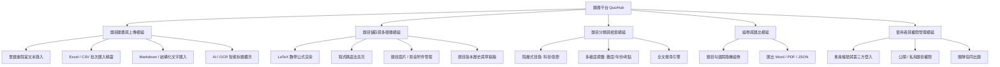
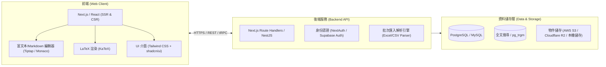
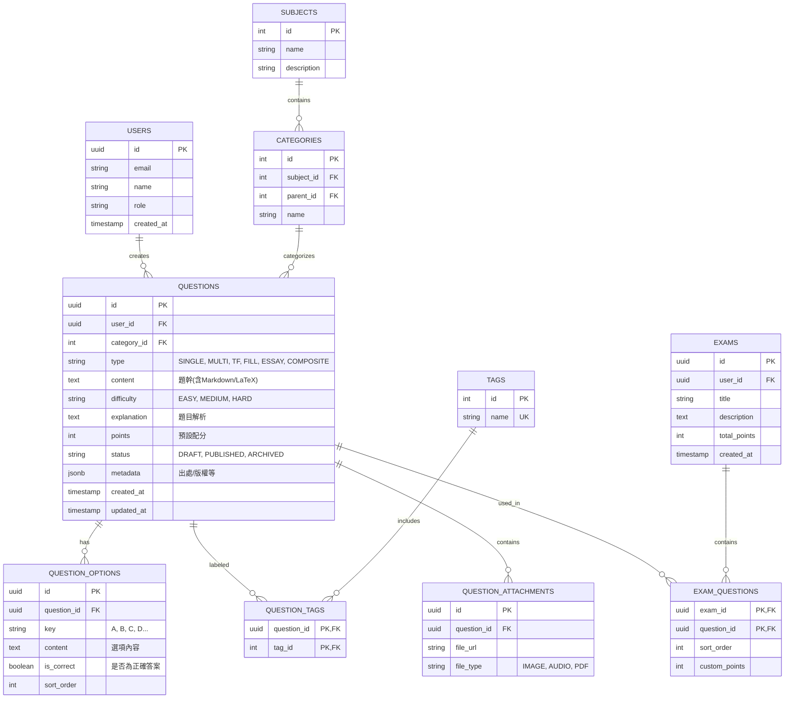
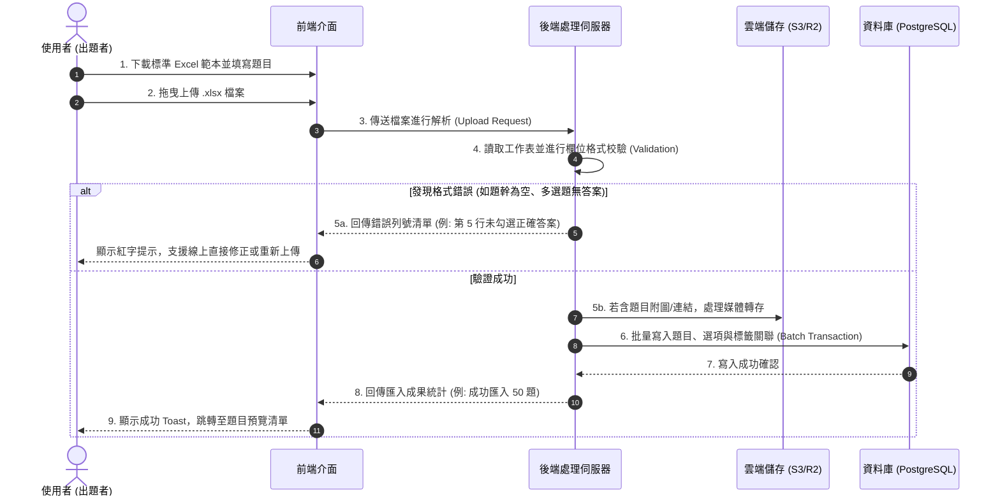
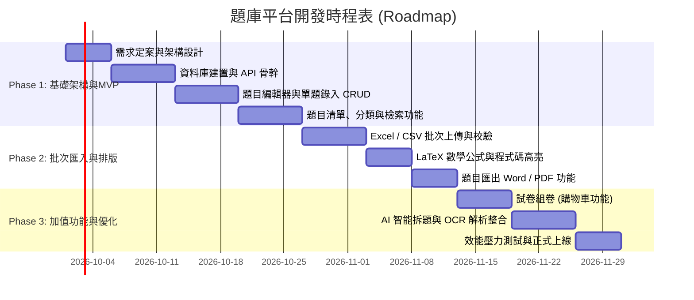

# 【線上題目管理與儲存平台】完整專案企劃書
**專案代號**：QuizHub（題庫方舟）  
**文件版本**：v1.0.0  
**撰寫日期**：2026 年  
**文件性質**：產品功能規劃、技術架構設計與開發時程指南  

---

## 1. 專案背景與目標 (Project Background & Objectives)

### 1.1 專案背景
不論是學校教師、補習班講師、程式與證照培訓機構，或是自主學習的考生，日常中都經常需要面對大量的題目、試題、筆記與詳解。然而，傳統的題目管理方式多半仰賴 Word 檔案、Excel 表格或紙本講義，常面臨以下問題：
- **題目零散難尋**：檔案分散在不同資料夾，難以根據標籤、難度或知識點快速檢索。
- **排版混亂與公式失真**：數學公式、化學結構、程式碼或圖片排版在不同裝置與軟體版本間容易跑版。
- **缺乏版本與協同機制**：題目修改、勘誤後版本不同步，沒有審核與歷史記錄。
- **組卷與再利用成本高**：重複手動複製貼上題目，耗時且容易出錯。

### 1.2 專案願景與核心目標
打造一個**直覺、高效、結構化且具高擴展性**的「題目上傳、儲存與管理雲端平台」，使用者能夠：
1. **多元化題目上傳**：支援手動輸入、批量上傳（Excel / CSV）、Markdown / 結構化文字解析，以及未來擴展的 AI OCR 題目自動辨識。
2. **完整格式與多題型相容**：支援單選題、多選題、是非題、填空題、簡答題、程式題與綜合題組，完整相容 LaTeX 數學公式、程式碼高亮與多媒體附件。
3. **結構化分類與高效檢索**：建立多階層目錄（學科/單元/章節）與多維度標籤（難易度、出處、重要性、關鍵字），實現秒級全文檢索。
4. **安全儲存與再利用**：雲端安全儲存、題目版本紀錄、題目匯出（Word/PDF/JSON），並支援未來快速一鍵組卷與測驗。

---

## 2. 目標受眾與痛點分析 (Target Audience & Pain Points)

| 目標使用者族群 | 主要使用情境 | 核心痛點 | 解決方案 |
| :--- | :--- | :--- | :--- |
| **教育從業者** (中小學、高中、大學教師) | 段考、隨堂考、期末試卷出題與長期題庫累積 | 題目排版耗時、Word 剪貼混亂、難以追蹤哪題考過 | 結構化題庫、考期記錄、標籤分類、一鍵篩選出卷 |
| **補習班與證照培訓機構** | 大量考古題解析、模擬考題庫管理、團隊協同出題 | 題庫龐大不易多人協同、各科題目格式不統一 | 團隊權限管理、Excel 批次匯入、統一排版規範 |
| **自學考生與學生族群** | 整理個人錯題本、重點題目收集與複習 | 錯題難以按弱點知識點歸納、缺乏隨身複習工具 | 隨手拍照/上傳錯題、標籤標註理解度、隨機抽考 |
| **程式 / 資訊技術學習者** | 收集演算法題目、技術面試題、LeetCode 解題思路 | 一般題庫不支援 Markdown、程式碼語法高亮與複雜測資 | 內建 Markdown 編輯器、支援多種程式碼高亮與自定義輸出入 |

---

## 3. 系統功能架構與規格 (Functional Architecture)

### 3.1 題目建置與上傳模組 (Core)
1. **單題表單錄入 (富文本編輯器)**
   - **題幹編輯**：支援粗體、斜體、表格、清單、圖片、音訊嵌入。
   - **數學公式支援**：內建 KaTeX / MathJax 語法輸入，支援即時預覽（如 `$E = mc^2$`）。
   - **程式碼高亮**：支援各主流語言（Python, C++, Java, JS 等）語法高亮顯示與行號。
   - **題型支援**：
     - 單選題 (Single Choice)
     - 多選題 (Multiple Choice)
     - 是非題 (True / False)
     - 填空題 (Fill in the Blank)
     - 簡答 / 問答題 (Short Answer / Essay)
     - 題組 / 綜合題 (Composite Question)：一篇文章/題幹，下方掛載多小題。
   - **答案與解析區塊**：標準解答、詳細圖文解析、答題解法提示。
   - **後設資料 (Metadata)**：設定難易度（易/中/難/競賽）、預估作答時間、適用年級/學期、出處（例：112年會考、原創）。

2. **批量上傳精靈 (Batch Import Wizard)**
   - **Excel / CSV 匯入**：
     - 提供標準匯入範本下載（包含：題型、題幹、選項A-F、正確答案、解析、標籤）。
     - 匯入前**即時預覽與資料驗證 (Validation)**：若格式有誤（如缺少答案、題型不符），標示具體出錯行數並提示修正，避免髒資料入庫。
   - **Markdown 批次解析匯入**：
     - 支援自定義 Markdown 語法（例如利用 `---` 分割題目、`Q:` 為題幹、`A)` 為選項、`Ans:` 為答案），系統自動解析轉為結構化題目。
   - **AI 智能題目辨識 (擴充模組)**：
     - 上傳試卷 PDF 或相片，串接視覺模型 (LLM/OCR) 自動將非結構化題目切分成題幹、選項、答案與解析。

### 3.2 題目儲存與檢索管理
1. **結構化分類樹**：
   - 多層級分類（例如：`高中` > `物理` > `高二上` > `牛頓運動定律`）。
   - 靈活標籤系統（支援自由輸入標籤，如 `#段考常考`、`#108課綱`、`#易錯陷阱`）。
2. **多維度組合搜尋與篩選**：
   - 關鍵字全文搜尋（模糊搜尋題幹、解析、標籤）。
   - 側邊欄篩選器：按題型、科目、難易度、建立時間、是否有解析、出處篩選。
3. **題目生命週期管理**：
   - **草稿箱**：未編輯完成之題目暫存。
   - **版本歷程**：題目修改後保留舊版本，方便比對勘誤紀錄。
   - **垃圾桶機制**：防手滑誤刪，提供 30 天還原功能。

### 3.3 試卷組卷與匯出 (加值功能)
- **購物車式組卷 (Question Basket)**：在題目列表勾選加入「試題清單」，隨時查看已選題目數量、配分與題型分佈。
- **排版匯出**：
  - 匯出為 **學生測驗卷 (PDF / Word)**：隱藏答案與解析。
  - 匯出為 **教師解答卷 (PDF / Word)**：含答案、計分與完整解析。
  - 匯出為 **JSON / XML 格式**：供其他學習管理系統 (LMS) 或線上測驗平台匯入。

### 3.4 會員與權限控制
- **個人版**：個人題庫完全私有，可自行備份與匯出。
- **組織/團隊協同版**：
  - 角色：系統管理員、主編審題者、出題老師、實習教師。
  - 題庫空間共享，支援協同出題、審題與題目留言討論。

---

## 4. 技術架構與選型推薦 (Technical Architecture)

為了確保系統的**響應速度、公式渲染效能、搜尋效率與易維護性**，建議採用現代全端主流技術架構：

### 4.1 推薦技術堆疊 (Tech Stack)

| 層級 | 推薦技術 | 選擇原因與優勢 |
| :--- | :--- | :--- |
| **前端框架** | **Next.js 14+ (React / App Router)** 或 **Vue 3 (Nuxt 3)** | 支援伺服端渲染 (SSR) 與靜態優化，兼顧 SEO、頁面加載效能與前後端整合開發效率。 |
| **UI 與樣式** | **Tailwind CSS + shadcn/ui + Lucide Icons** | 現代化精美介面、完全可客製化、無障礙支援、開發速度極快。 |
| **編輯器與渲染** | **Tiptap (富文本) + KaTeX (數學公式) + Prism/Shiki (程式碼高亮)** | Tiptap 架構彈性高，能無縫整合數學公式嵌入、圖片上傳預覽與自定義題幹標籤。KaTeX 渲染效能是 MathJax 的 10 倍以上。 |
| **後端與 API** | **Next.js Server Actions / API Routes** (輕量型) 或 **FastAPI / NestJS** (獨立型) | 若想前後端一體快速上線，Next.js API 最佳；若需要高頻率 AI 處理與大量資料運算，Python FastAPI 也是極佳選擇。 |
| **資料庫 (Database)** | **PostgreSQL (搭配 Prisma ORM)** | 關聯式資料庫極適合科目分類、題目選項與標籤關係；PostgreSQL 的 `JSONB` 與 `tsvector` 能同時兼顧彈性題型資料結構與全文搜尋。 |
| **檔案與圖片儲存** | **Cloudflare R2 / AWS S3 / Supabase Storage** | 存放題目附圖、音訊與批量匯入檔案，低延遲且儲存成本低廉。 |
| **認證機制** | **Auth.js (NextAuth) / Supabase Auth** | 支援 Email 驗證碼、Google / GitHub 第三方 OAuth 快速登入。 |

---

## 5. 資料庫核心架構設計 (Database Schema Design)

以下為採用 PostgreSQL 設計的核心實體關聯圖 (E-R Diagram)：

---

## 6. 關鍵業務流程與使用者體驗 (User Journeys)

### 6.1 題目批量上傳 (Excel) 處理流程

---

## 7. UI/UX 頁面規劃與功能清單

1. **工作台儀表板 (Dashboard)**
   - 題庫總量統計卡片（總題數、各題型佔比、本週新增、待審核題目）。
   - 最近更新的題目清單與快速捷徑（「快速出題」、「批量匯入」、「自組試卷」）。
2. **題目管理主頁 (Question Repository List)**
   - **頂部搜尋列**：支援關鍵字即時模糊搜尋。
   - **左側過濾導覽欄**：按學科分類樹狀展開、難度等級勾選、標籤多選。
   - **中央題目卡片清單**：
     - 卡片清晰展示：題幹摘要、題型標籤、標籤 Chips、難度色塊、更新日期。
     - 懸浮/展開按鈕：即時展開題目完整選項、答案與解析，無需頻繁跳頁。
     - 批次操作列：勾選多題進行「批次加入試卷」、「批次打標籤」、「批次刪除」、「批次匯出」。
3. **題目編輯器 (Question Editor)**
   - 採用雙欄或分頁佈局：左側編輯原始內容與設定，右側**即時預覽 (Live Preview)**。
   - 選項動態增減（快捷鍵按 `Tab` 或按鈕新增選項 E、F）。
4. **批量匯入精靈頁 (Batch Import Wizard)**
   - 三步驟流程引導：
     - Step 1: 下載範本與上傳檔案。
     - Step 2: 系統自動讀取並展示表格預覽，支援在網頁表格上微調修改內容。
     - Step 3: 確認提交並完成分類歸檔。

---

## 8. 專案開發時程與里程碑 (Roadmap)

專案預計分為三個階段進行，整體 MVP 開發週期約為 **4～6 週**：

### 時程里程碑詳細規劃：
- **第一階段：MVP 最小可行性產品 (1~3 週)**
  - 帳號系統（註冊/登入/個人權限）。
  - 單題錄入表單（單選、多選、是非、簡答）。
  - 基礎科目與標籤管理。
  - 題目列表、詳細頁、修改、刪除、關鍵字搜尋。
- **第二階段：進階格式與批次上傳 (4~5 週)**
  - 支援 Excel 模組下載與批次上傳、資料校驗與錯誤提示。
  - LaTeX 數學公式與 Markdown 程式碼區塊解析支援。
  - 題目圖片上傳與雲端儲存支援。
- **第三階段：加值應用與自動化 (6 週以後)**
  - 隨意勾選題目組卷，並匯出排版良好的 PDF / Word 試卷與詳解。
  - 串接 AI Vision (如 Gemini / GPT-4o) 支援試卷截圖自動識別切割成結構化題目。

---

## 9. 風險評估與應對策略 (Risk Assessment)

| 風險項目 | 風險等級 | 潛在影響 | 應對對策 |
| :--- | :---: | :--- | :--- |
| **批次匯入資料格式混亂** | **高** | 使用者自製 Excel 欄位對不齊、缺漏答案導致程式崩潰或寫入髒資料。 | 1. 後端嚴格校驗 Schema (使用 Zod 等庫)。 2. 匯入前在前端提供即時資料預覽與防呆提示。 |
| **數學公式與圖片排版相容性** | **中** | 不同瀏覽器或 Word 匯出時公式可能跑版、缺字體。 | 1. 統一採用標準 LaTeX 語法儲存。 2. 匯出 PDF 時由伺服端使用無頭瀏覽器 (Puppeteer) 渲染後轉存，保證視覺絕對一致。 |
| **大題目量下的檢索效能** | **中** | 題庫累積超過數萬題時，模糊搜尋可能變慢。 | 1. 資料庫建置 B-Tree 與 GIN (全文檢索索引)。 2. 後續可平滑遷移至 Meilisearch 或 Elasticsearch 專屬搜尋引擎。 |
| **題目版權與資料安全性** | **高** | 機密試題外流或使用者未授權上傳有版權教材。 | 1. 預設所有上傳題目為「私有空間」。 2. 支援資料定期自動備份與題目匯出成 JSON 封裝檔。 |

---

## 10. 結論與下一步行動建議

本企劃書為「題目上傳與儲存平台」提供了一套完整、具擴展性且易於落地的標準規格。

**建議下一步啟動工作：**
1. **確認技術棧**：確認是否採用 **Next.js + Tailwind CSS + PostgreSQL (Prisma)** 作為核心全端技術。
2. **啟動 MVP 專案工程**：
   - 初始化專案結構。
   - 建立資料庫 Model (Prisma Schema)。
   - 實作第一個題目上傳表單與檢視清單。
